# Objective:

A simple RESTful API for managing a list of users, testing concepts such as routing, middleware, HTTP methods, status codes, error handling, and interaction with a data source.

## How to run:

### 1. Initialize a Node.js project: (5 marks)

- `npm install Express`
- `node --watch index.js`

### 2. Use thunderclient or postman to test the url response.

# Test Screenshots of All Methods

## GET

### `GET /users` – Fetch the list of all users.

##### !Screenshot of GET /users
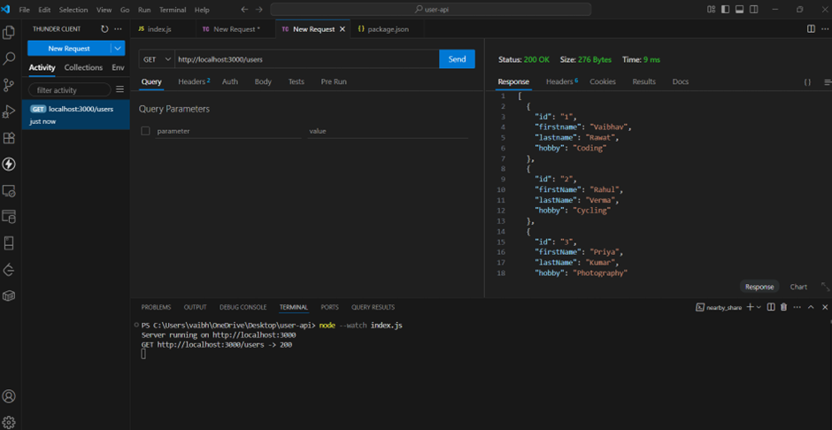

### `GET /users/:id` – Fetch details of a specific user by ID.

##### !Screenshot of GET /users/:id
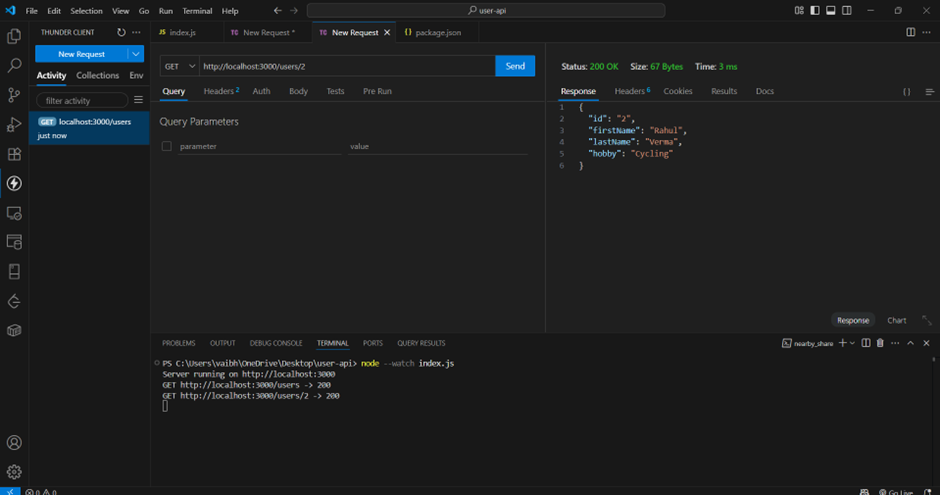

### Error while GET user by ID

##### !Screenshot of GET /users/:id Error
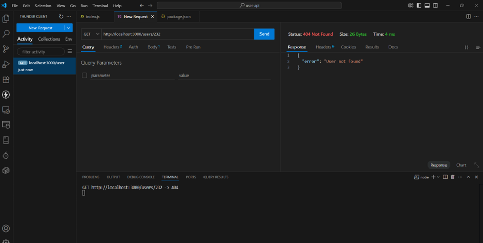

---

## POST Method

### `POST /user` – Add a new user

#### Success:

##### !Screenshot of successful POST /user
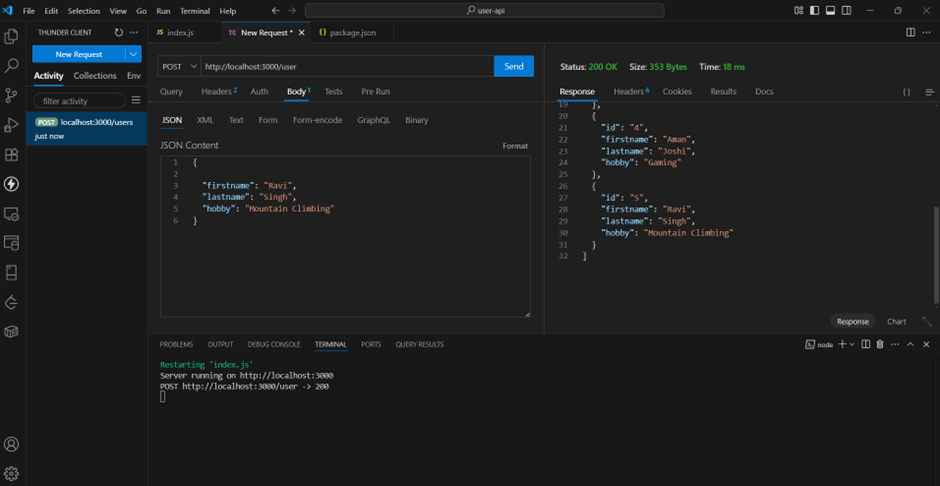

#### Errors While POST:

- **Missing fields**
  ##### !Screenshot of missing fields POST error
  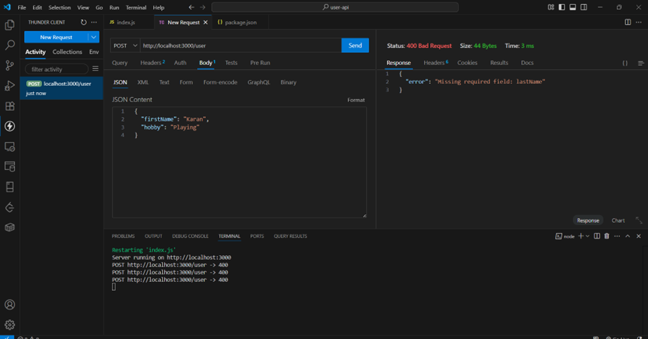
- **Invalid fields**
  ##### !Screenshot of invalid fields POST error
  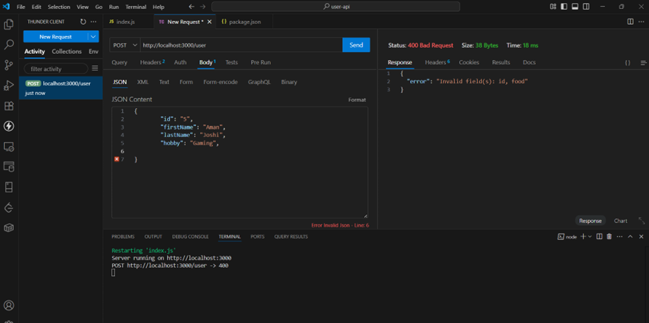

---

## PUT Method

### `PUT /user/:id` – Update details of an existing user

#### Success:

##### !Screenshot of successful PUT /user/:id
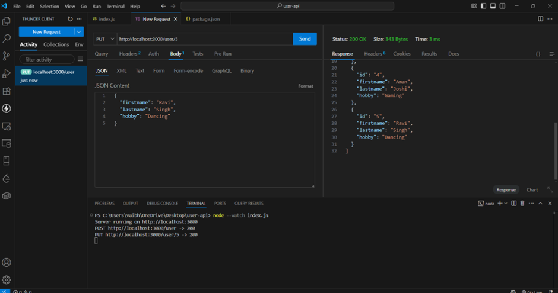

#### Errors While PUT:

- **Invalid fields**
  ##### !Screenshot of invalid fields PUT error
  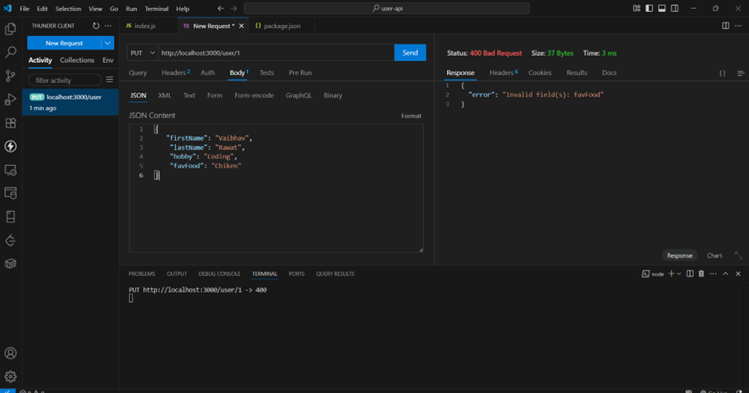
- **Missing fields**
  ##### !Screenshot of missing fields PUT error
  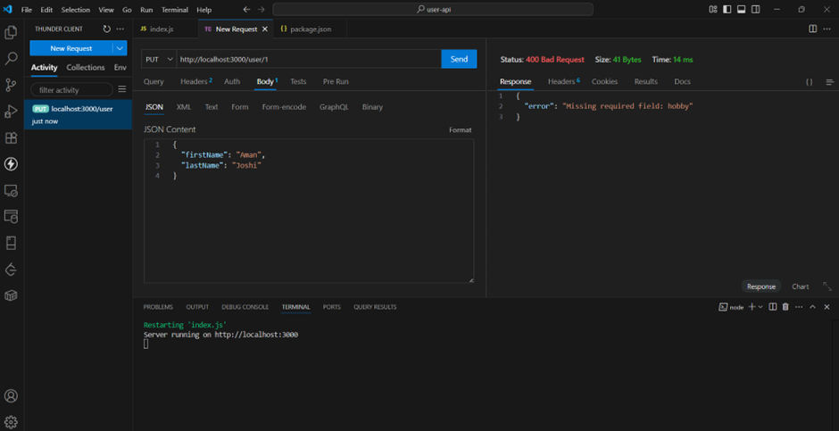
- **User not found**
  ##### !Screenshot of user not found error
  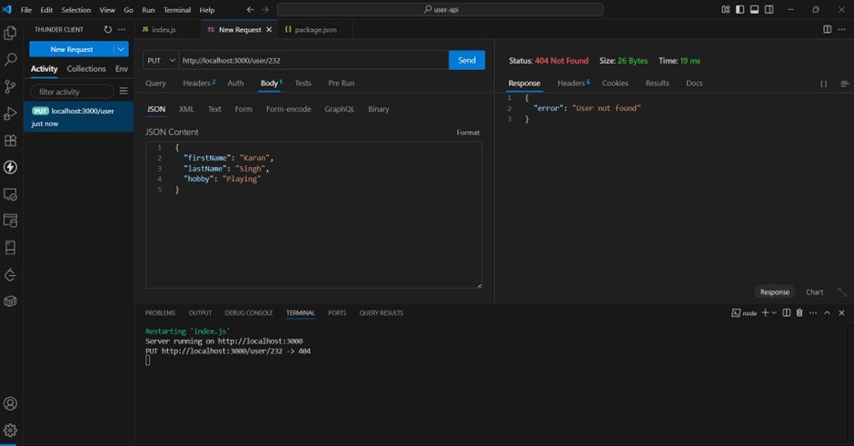

---

## DELETE Method

### `DELETE /user/:id` – Delete a user by ID

#### Success and displaying the deleted user:

##### !Screenshot of DELETE success

#### Now when we GET all users, only 3 users are left:

##### !Screenshot of updated user list after DELETE
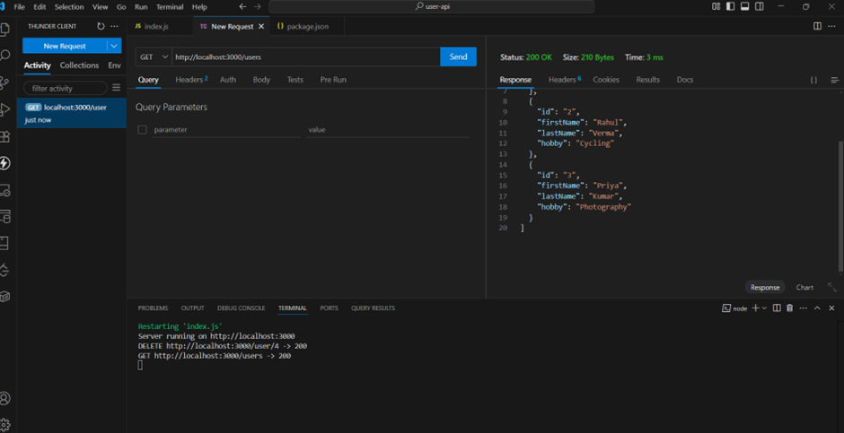
